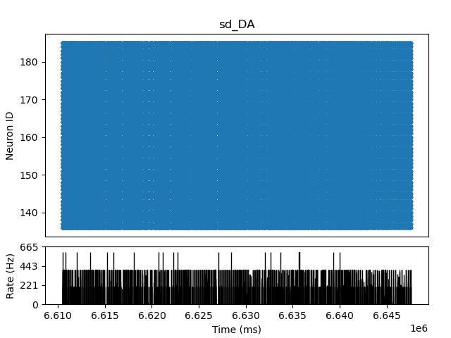
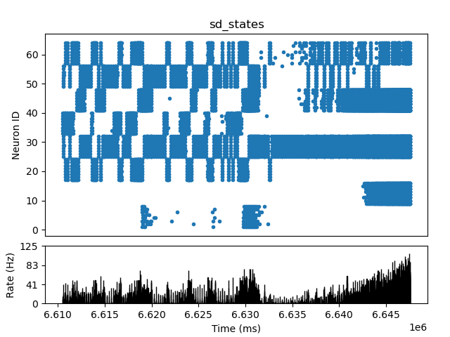

# Master's thesis
_author: Borislav Markov_ 

_advisor: prof. Petya Koprinkova-Hristova_

_university: Sofia University, Bulgaria_

# Solving a reinforcement learning task with continuous observation space using NEST neuro simulator

##  Introduction
This is master's thesis in bulgarian language and in README is only
the resume of what has been achieved. Complete document is inside "doc"
folder. 
The thesis solves the Cartpole task suggesting two variants of SNN
(Spiking Neural Nets) using the neurobiological simulator NEST.


##  Cartpole environment
Carpole environment is part of the Classic Control 
environments, part of Gym.


This environment corresponds to the version of the 
cart-pole problem described by Barto, Sutton, 
and Anderson in “Neuronlike Adaptive Elements That 
Can Solve Difficult Learning Control Problem”. 
A pole is attached by an un-actuated joint to a cart, 
which moves along a frictionless track. The pendulum 
is placed upright on the cart and the goal is to balance 
the pole by applying forces in the left and right 
direction on the cart.
https://gymnasium.farama.org/environments/classic_control/cart_pole/ 

###  Action Space
The action is a ndarray with shape (1,) which can take values {0, 1} indicating the direction of the fixed force the cart is pushed with.

0: Push cart to the left

1: Push cart to the right

### Observation Space
The observation is a ndarray with shape (4,) with the 
values corresponding to the following positions and velocities:

| Num | Observation | Min | Max|
|-----|-------------|-----|---|
| 0 | Cart Position | -4.8 | 4.8 |
| 1  |  Cart Velocity|-Inf|Inf|
| 2  | Pole Angle|~ -0.418 rad (-24°)|~ 0.418 rad (24°)|
| 3 |Pole Angular Velocity| -Inf|Inf|


Note: While the ranges above denote the possible values for observation space of each element, it is not reflective of the allowed values of the state space in an unterminated episode. Particularly:

The cart x-position (index 0) can be take values between (-4.8, 4.8), but the episode terminates if the cart leaves the (-2.4, 2.4) range.

The pole angle can be observed between (-.418, .418) radians (or ±24°), but the episode terminates if the pole angle is not in the range (-.2095, .2095) (or ±12°)

### Rewards
Since the goal is to keep the pole upright for as long as possible, a reward of +1 for every step taken, including the termination step, is allotted. The threshold for rewards is 475 for v1.

### Starting State
All observations are assigned a uniformly random value in (-0.05, 0.05)

### Episode End
The episode ends if any one of the following occurs:

Termination: Pole Angle is greater than ±12°

Termination: Cart Position is greater than ±2.4 (center of the cart reaches the edge of the display)

Truncation: Episode length is greater than 500 (200 for v0)

##  Neurobiology basics
Think of a neuron not only in terms of ions and channels, 
as many biologists do, and not only in terms of an input/output 
relationship, but also as a nonlinear dynamical system that 
looks at the input through the prism of its own intrinsic dynamics[3].
Neurons can transmit electrical signals over long distances.

<div style="text-align: center;">
 <br>
<i>Two interconnected cortical pyramidal neurons (hand drawing) and in vitro
recorded spike. Copied from Izhikevich [3]</i>
</div>

Neurons communicates through spikes.

## NEST Simulator
NEST is a simulator for spiking neural network models that focuses 
on the dynamics, size and structure of neural systems rather than 
on the exact morphology of individual neurons. The development of 
NEST is coordinated by the NEST Initiative.
https://www.nest-simulator.org/

Here is a simple python program that uses NEST smulator.
```python
import nest
neurons = nest.Create("iaf_psc_alpha", 10000, {
    "V_m": nest.random.normal(-5.0),
    "I_e": 1000.0
})
input = nest.Create("noise_generator", params={
    "amplitude": 500.0
})
nest.Connect(input, neurons, syn_spec={'synapse_model': 'stdp_synapse'})
spikes = nest.Create("spike_recorder", params={
    'record_to': 'ascii',
    'label': 'excitatory_spikes'
})
nest.Connect(neurons, spikes)
nest.Simulate(100.0)
nest.raster_plot.from_device(spikes, hist=True)
plt.show()

```
Running the simulator can give you recordings of virtual devices pluggen 
inside your artificial neurons.

<div style="text-align: center;">
 <br>
<i>Membrane potential of integrate-and-fire neuron with constant input current</i>
</div>

<div style="text-align: center;">
 <br>
<i>Spikes of the neuron.</i>
</div>

##  Theoretical solution

Neurons, the main components of nervous systems, are cells specialized for processing
and transmitting information using electrical and chemical signals. They come in many
forms, but a neuron typically has a cell body, dendrites, and a single axon. Dendrites
are structures that branch from the cell body to receive input from other neurons (or to
also receive external signals in the case of sensory neurons). A neuron's axon is a fiber
that carries the neuron's output to other neurons (or to muscles or glands). A neuron's
output consists of sequences of electrical pulses called action potentials that travel along
the axon. Action potentials are also called spikes, and a neuron is said to fire when it
generates a spike. In models of neural networks it is common to use real numbers to
represent a neuron's firing rate, the average number of spikes per some unit of time.[1]


<div style="text-align: center;">
 <br>
<i>Actor-critic ANN and a hypothetical neural implementation.Copied from [1]</i>
</div>

Above figure shows an implementation of an actor-critic algorithm as an ANN with
component networks implementing the actor and the critic. The critic consists of a single
neuron-like unit, V , whose output activity represents state values, and a component
shown as the diamond labeled TD that computes TD errors by combining V 's output
with reward signals and with previous state values (as suggested by the loop from the
TD diamond to itself). The actor network has a single layer of k actor units labeled Ai,
i = 1...k. The output of each actor unit is a component of a k-dimensional action
vector. An alternative is that there are k separate actions, one commanded by each actor
unit, that compete with one another to be executed, but here we will think of the entire
A-vector as an action.

The TD error produced by circuitry in the critic is the reinforcement signal for changing
the weights in both the critic and the actor networks. This is shown in figure by
the line labeled `TD error δ' extending across all of the connections in the critic and
actor networks [1].

<div style="text-align: center;">
 <br>
<i>Basic structure for actor-critic involving temporal difference error.Copied from [2]</i>
</div>

Reinforcement task can be seen as minimizing TD(0) error which is represented as
```text
δ = r(t) + γV(t+1) - V(t)
```
Implementation network is described on the next figure. 
Learning is done through Spike-timing-dependent plasticity (STDP).

<div style="text-align: center;">
 <br>
<i>Variant 2 implementation.</i>
</div>


##  Simulations
Simulations of variant 2 which is considered to solve the Cartpole problem can be seen on the next figures.

<div style="text-align: center;">
 <br>
<i>Variant 2 solution.</i>
</div>

Spikes from the last episode are given below:

<div style="text-align: center;">
 <br>
<i>Spikes of the Critic</i>
</div>

<div style="text-align: center;">
 <br>
<i>DA spikes (dopamine activator)</i>
</div>

<div style="text-align: center;">
 <br>
<i>Spikes of the States</i>
</div>

<div style="text-align: center;">
 <br>
<i>Winner-take-all spikes</i>
</div>

You can try to use this solution to other tasks by changing the inputs and tuning hyper parameters.

##  Sources
[1] Sutton R., Barto A. (2018), Reinforcement Learning: An Introduction, The MIT Press, http://www.incompleteideas.net/book/the-book-2nd.html

[2] O’Reilly R. et al. (2020), Computational Cognitive Neuroscience, Open Textbook, freely available, https://compcogneuro.org/

[3] Izhikevich E (2005), Dynamical Systems in Neuroscience: The Geometry of Excitability and Bursting, The MIT Press, (https://www.izhikevich.org/publications/dsn.pdf)

[4] CartPole, OpenGym, https://www.gymlibrary.dev/environments/classic_control/cart_pole/  

[5] NEST simulator, https://nest-simulator.readthedocs.io/en/v3.3/index.html  

[6] Gerstner W, Kistler M, Naud R, Paninski L. (2014), Neuronal Dynamics, Cambridge university press, https://neuronaldynamics.epfl.ch/online/index.html

[7] Potjans W., Morrison A., Diesmann M. (2010), Enabling functional neural circuit simulations with distributed computing of neuromodulated plasticity, Frontiers in COMPUTATIONAL NEUROSCIENCE.

[8] Doya, K. (2000), Complementary roles of basal ganglia and cerebellum in
learning and motor control, Current Opinion in Neurobiology 2000, 10:732–739, Elsevier Science Ltd

[9] Koprinkova-Hristova, P.(2020), Brain-Inspired Spike Timing Model of Dynamic Visual Information Perception and Decision Making with STDP and Reinforcement Learning, Springer Nature Switzerland AG

[10] Florian, R. (2007), Reinforcement Learning Through Modulation of Spike-Timing-Dependent Synaptic Plasticity

[11] Xu, Jian, How to Beat the CartPole Game in 5 Lines, https://towardsdatascience.com/how-to-beat-the-cartpole-game-in-5-lines-5ab4e738c93f

[12] Surma ,Greg, Cartpole - Introduction to Reinforcement Learning (DQN - Deep Q-Learning)  https://gsurma.medium.com/cartpole-introduction-to-reinforcement-learning-ed0eb5b58288#c876

[13] Kale, Siddhart, Solving CartPole-V1, https://medium.com/@siddharthkale/solving-cartpole-v1-4be909b7c2c6

[14] Barto A. Sutton R., (1983), Neuronlike adaptive elements that can solve difficult learning control problems, IEEE, http://incompleteideas.net/papers/barto-sutton-anderson-83.pdf

[15] Doya, Kenji, (2000),Reinforcement Learning In Continuous Time and Space, ATR Human Information Processing Research Laboratories, Japan

[16] Qiu H., Garratt M., Howard D., Anavatti S.,(2019) Evolving Spiking Neural Networks for Nonlinear Control Problems, arXiv:1903.01180v1

##  License
Copyright 2023 Borislav Stoyanov Markov

Licensed under the Apache License, Version 2.0 (the "License");
you may not use this file except in compliance with the License.
You may obtain a copy of the License at

    http://www.apache.org/licenses/LICENSE-2.0

Unless required by applicable law or agreed to in writing, software
distributed under the License is distributed on an "AS IS" BASIS,
WITHOUT WARRANTIES OR CONDITIONS OF ANY KIND, either express or implied.
See the License for the specific language governing permissions and
limitations under the License.
